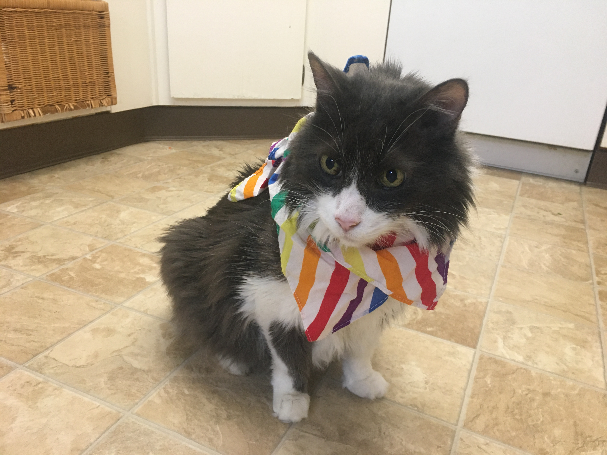
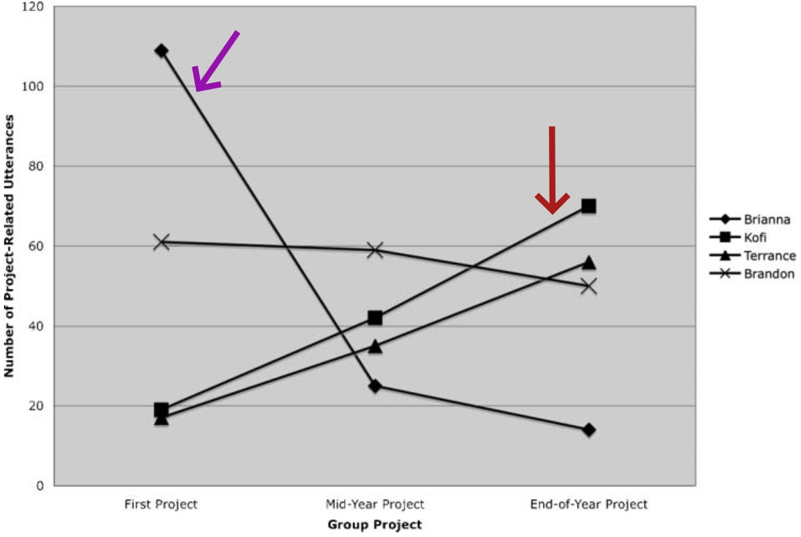
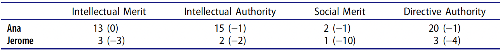
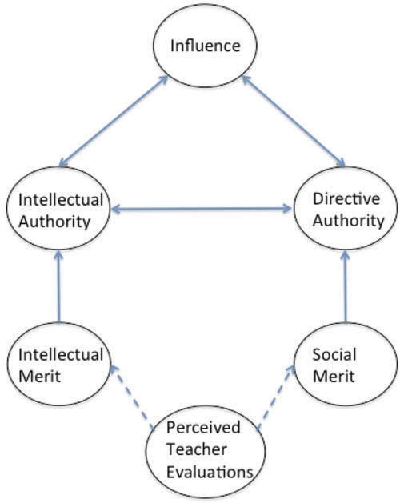
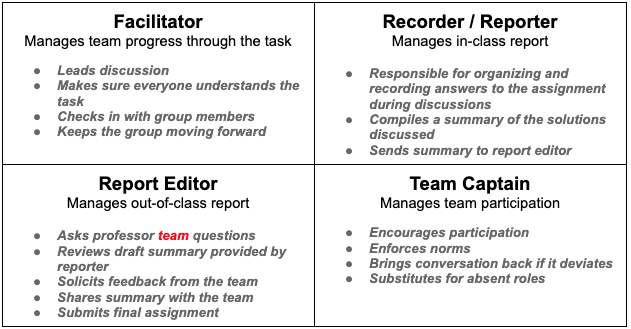
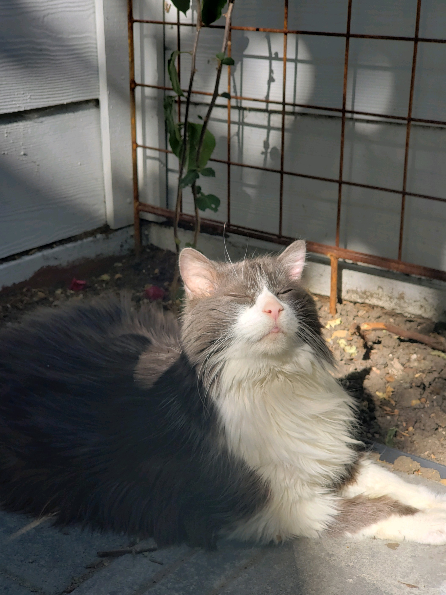
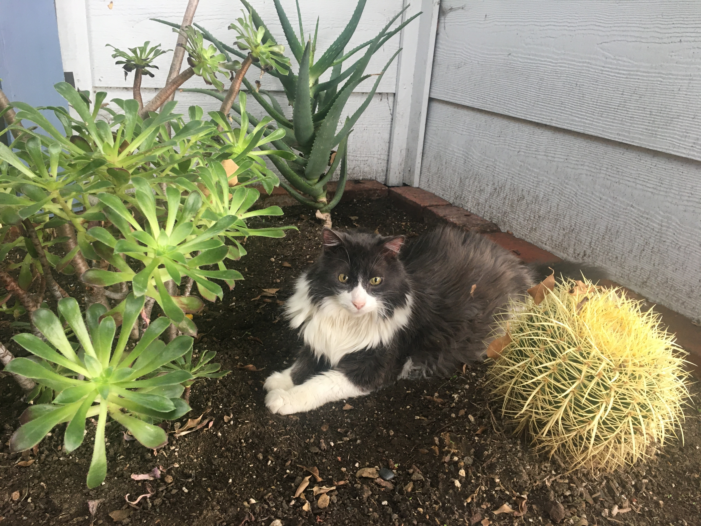
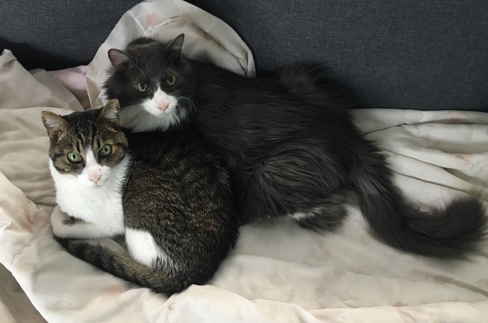

```{r setup, include = FALSE}
# R options
options(
  htmltools.dir.version = FALSE,
  tibble.width = 65,
  width = 65
  )

# figure height, width, dpi
knitr::opts_chunk$set(fig.width = 8, 
                      fig.asp = 0.618,
                      out.width = "60%",
                      fig.align = "center",
                      dpi = 300)

# fontawesome
htmltools::tagList(rmarkdown::html_dependency_font_awesome())

# magick
dev.off <- function(){
  invisible(grDevices::dev.off())
}

# xaringanExtra
library(xaringanExtra)
xaringanExtra::use_panelset()

library(emo)
```

class: middle, inverse

```{r set-theme, include = FALSE}
library(xaringanthemer)
style_duo_accent(
  primary_color      = "#b76352", # mango
  secondary_color    = "#34605f", # bayberry
  header_font_google = google_font("Raleway"),
  text_font_google   = google_font("Raleway", "300", "300i"),
  code_font_google   = google_font("Source Code Pro"),
  header_color = "#793540", #rhubarb
  white_color = "#F5F5F5", # lightest color
  black_color = "#36454F", # darkest color
  text_font_size = "30px", 
  link_color = "#a17b76" #pink
)
```

## .larger[.grey[.hand[Welcome!]]]

.pull-left[


]
.pull-right[
.center[
.large[
.honey[
Link for slides & resources: 
]

🔗 [https://bit.ly/allisonscats](https://bit.ly/allisonscats)
]]
]

---

class: center, middle

.larger[Land Acknowledgement]

.bayberry[Cal Poly sits on the land of the yak titʸu titʸu yak tiłhini,
Northern Chumash tribe. We acknowledge, respect, and thank the yak titʸu titʸu
yak tiłhini on whose **stolen land** we are guests. 

Indigenous people are not relics of the past. We who work and live here must
bear witness to the ongoing effects of colonization.

<!-- Land acknowledgements do not exist in a past tense, or historical context:  -->
<!-- colonialism is a current ongoing process, and we need to build our mindfulness -->
<!-- of our present participation. -->
]

---

class: center, middle, inverse

.larger[.mango[Let's start with a conversation...]]

--

.large[What successes have you experienced with group work?]

.large[What issues have you experienced with group work?]

---

class: middle

.larger[.bayberry[What do I mean by student "authority"?]]

--

.pull-left[
*Intellectual Authority* 

- Ideas are evaluated as high quality
- Gains and maintains conversational floor without interruption
- Are spatially attended to
]

--

.pull-right[
*Directive Authority*

- Ability to issue directives to peers
- Authority to manage group dynamics
]

---

class: center, middle

.larger[Why is student authority important?]

--

Learning in classrooms goes beyond understanding new concepts. 

--

Students also learn who they are and what they can and cannot do. 

<!-- Students’ identities are “dynamically negotiated,” representing a synthesis of -->
<!-- who they are and who they have learned to be through interactions with others.  -->

--

These identities / beliefs largely determine what students' participation in the
classroom looks like. 

---

class: center, middle, inverse

.huge[.hand[.honey[Classroom Discourse]]]

---

class: middle

<center>
.larger[.bayberry[Brianna & Kofi]]
</br>
.large[(Langer-Osuna, 2011)]
</center>
--

.pull-left[
- Took initial lead in group  

- Positioned by teacher as example of good leadership  

- Midway through project group members positioned her as bossy
]

--

.pull-right[
- Initially uninvolved in group  

- Positioned by boys as smart  

- Was given intellectual and directive authority by the boys
]

---

class: middle, center

.pull-left[
.large[***Boys don't listen to girls. It's not just in the classroom, it's outside,
too.*** (Brianna)]
]

.pull-right[
```{r, echo = FALSE, out.width = "100%"}

```
]

---

class: middle

<center>
.larger[.gray[Anna & Jerome]]
</br>
.large[(Langer-Osuna, 2016)]
</center>

--



</br>
</br>
<center>
***Meta-level intentions are likely to reside in the mechanisms of
interaction rather than in their explicit contents.*** (Sfard, 2001)

---

class: center

.pull-left[
.larger[**The role of the teacher**]

- Anna was positioned as behaving like a "good student" twice and off-task once

- Jerome was positioned as off-task 10 times and on-task once
]

```{r, echo = FALSE, out.height = "20%", out.width = "40%", fig.align = 'right'}

```

---

class: middle

<center>
.larger[.rhubarb[Uma & Sean]]  
</br>
.large[(Theobold & Williams, 2022)]
</center>

--

.pull-left[
- Solely responsible for establishing and maintaining a collaborative
environment  

- Never used closed language

- At the expense of having her mathematical thinking positioned as significant 
]

--

.pull-right[
- Shared his thinking in 86% of interactions

- Had his ideas positioned by Uma as significant in 60% of interactions

- Used closed language in 72% of interactions
]

---

class: middle

<center>
.large[***Such tedious micro-confirmations in mathematical work for a student
might be experienced as pain.*** (Gholson & Martin, 2020)]
</center>

--

<center>
.large[***As high-status students interact more in the group, they learn more
from the task; as low-status students interact less, they in turn learn
less.*** (Cohen et al., 1999)]
</center>

---

class: center, middle, inverse

.huge[.hand[.honey[What can we do?]]]

---

class: middle

<center>
.larger[Tools for Building More Equitable Groups]
</center>

--

.pull-left[
</br>
</br>
.large[.rhubarb[Groupworthy tasks!]]
]

.pull-right[
</br>
- Open-ended, uncertain tasks
- Multiple entry points
- Require multiple abilities to complete
- Intellectually important content
]

---

class: middle

<center>
.larger[Structured participation -- Group roles]




---

class: middle

<center>
.larger[.bayberry[Setting Discourse Expectations]]
</center>

.pull-left[.large[Establishing classroom norms]

  * Helping peers means explaining thinking, not giving answers or doing work
  for others. 
  * Provide justification when you make a statement.
]

--

.pull-right[
</br>
- Respect one another
- Intent and impact both matter
- Non-judgmental
- Take space, make space -- Share the air
- Embrace discomfort
- Make decisions by consensus
]

---

class: center, middle, inverse

.larger[.honey[The freer we are to make decisions about ourselves and the
worlds around us, the greater our responsibility.]
Sfard & Prusak (2005)
]

---

class: middle

<center>
.larger[Recognizing ***your*** interactions with students]

--

.large[.rhubarb[Language constructs realities in the classroom, reinforcing and
diminishing student identities.]]

--

.large[.bayberry[***Assigning competence is a public statement that specifically
recognizes the intellectual contribution a student has made to the group
task.*** (Cohen et al., 1999)]]

---

class: center, middle, inverse

.pull-left[

```{r, out.height = c("30%", "70%"), echo = FALSE}


```
]

.pull-right[
</br>
</br>

]

---

class: center, middle, inverse

.larger[.mango[Let's end with a conversation...]]

.large[What successes have you had when structuring equitable group
collaborations?]


